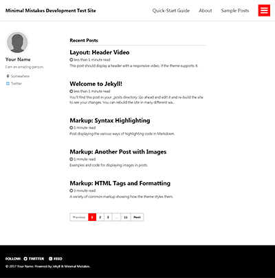
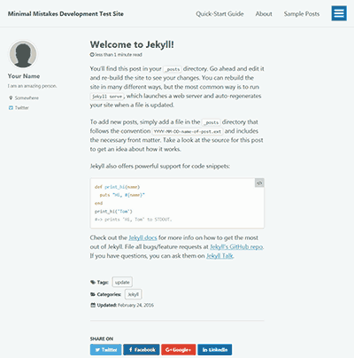
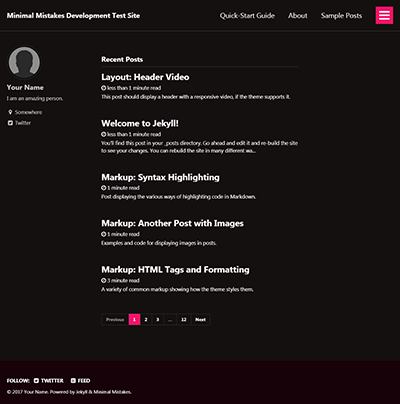
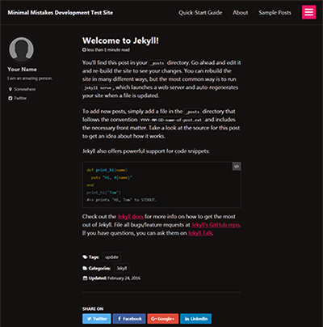
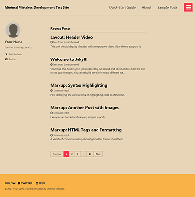

## 사이트 세팅

### Theme

테마의 Ruby gem 버전을 사용하는 경우 활성화하려면 다음 줄이 필요합니다.

```yaml
theme: minimal-mistakes-jekyll
```

### Skin

제공된 스킨 중 하나를 사용하여 테마의 색 구성표를 쉽게 변경할 수 있습니다.

```yaml
minimal_mistakes_skin: "default" # "air", "aqua", "contrast", "dark", "dirt", "neon", "mint", "plum", "sunrise"
```

#### Air skin: `air`

|
--|--

#### Aqua skin: `aqua`

|
--|--

#### Contrast skin: `contrast`

|
--|--

#### Dark skin: `dark`

|
--|--

#### Dirt skin: `dirt`

|
--|--

#### Mint skin: `mint`

|
--|--

#### Neon skin: `neon`

|
--|--

#### Neon skin: `plum`

|
--|--

#### Sunrise skin: `sunrise`

|
--|--

### 사이트 장소

`site.locale`은 사이트 내의 각 웹 페이지에 대한 기본 언어를 선언하는 데 사용됩니다.

예: `locale: "en-US"`는 사이트의 언어 속성을 미국(`US`)식 영어(`en`)로 설정합니다. 국가 코드는 선택사항이며 따라서 더 짧은 `locale: "en"`도 허용됩니다. 언어 및 국가 코드를 찾으려면 [참조표](https://docs.microsoft.com/en-us/previous-versions/commerce-server/ee825488(v=cs.20)?redirectedfrom=MSDN)를 확인하세요.

```yaml
locale: "en-US" # 한국 설정은 "ko-KR"
```

장소를 올바르게 설정하는 것은 [UI Text] 데이터 파일에서 찾은 현지화된 텍스트를 연결하는 데 중요합니다. 부적절하게 일치하면 UI의 일부가 사라집니다. (제목이나 버튼 레이블 등)

**참고**: 테마는 영어(en, en-US, en-GB)로 현지화된 텍스트와 함께 제공됩니다. `_config.yml`의 로케일을 다른 것으로 변경하면 대부분의 UI 텍스트가 공백이 됩니다. 이를 방지하려면 해당 로케일 키와 번역된 텍스트를 `_data/ui-text.yml`에 추가해야 합니다.
{: .notice--warning}
