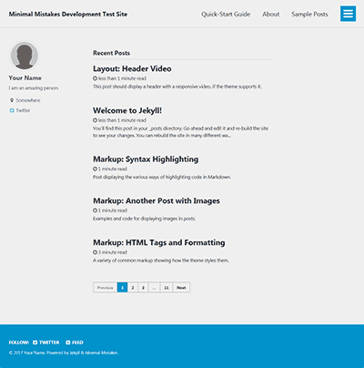
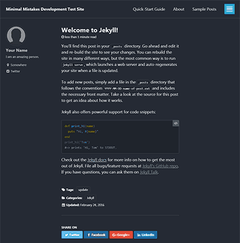
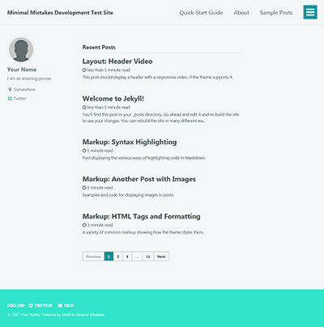

## 사이트 세팅

### Theme

테마의 Ruby gem 버전을 사용하는 경우 활성화하려면 다음 줄이 필요합니다.

```yaml
theme: minimal-mistakes-jekyll
```

### Skin

제공된 스킨 중 하나를 사용하여 테마의 색 구성표를 쉽게 변경할 수 있습니다.

```yaml
minimal_mistakes_skin: "default" # "air", "aqua", "contrast", "dark", "dirt", "neon", "mint", "plum", "sunrise"
```

#### Air skin: `air`

|
--|--

#### Aqua skin: `aqua`

|
--|--

#### Contrast skin: `contrast`

|
--|--

#### Dark skin: `dark`

|
--|--

#### Dirt skin: `dirt`

|
--|--

#### Mint skin: `mint`

|
--|--

#### Neon skin: `neon`

|
--|--

#### Neon skin: `plum`

|
--|--

#### Sunrise skin: `sunrise`

|
--|--

### 사이트 장소
