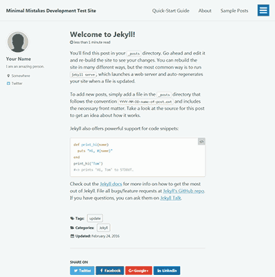

## Site Settings

### Theme

테마의 Ruby gem 버전을 사용하는 경우 활성화하려면 다음 줄이 필요합니다.

```yaml
theme: minimal-mistakes-jekyll
```

### Skin

제공된 스킨 중 하나를 사용하여 테마의 색 구성표를 쉽게 변경할 수 있습니다.

```yaml
minimal_mistakes_skin: "default" # "air", "aqua", "contrast", "dark", "dirt", "neon", "mint", "plum", "sunrise"
```

#### Air skin: `air`

|
--|--

#### Aqua skin: `aqua`

|
--|--

#### Contrast skin: `contrast`

|
--|--

#### Dark skin: `dark`

|
--|--

#### Dirt skin: `dirt`

|
--|--

#### Mint skin: `mint`

|
--|--

#### Neon skin: `neon`

|
--|--

#### Neon skin: `plum`

|
--|--

#### Sunrise skin: `sunrise`

|
--|--

### Locale

`site.locale`은 사이트 내의 각 웹 페이지에 대한 기본 언어를 선언하는 데 사용됩니다.

예: `locale: "en-US"`는 사이트의 언어 속성을 미국(`US`)식 영어(`en`)로 설정합니다. 국가 코드는 선택사항이며 따라서 더 짧은 `locale: "en"`도 허용됩니다. 언어 및 국가 코드를 찾으려면 [참조표](https://docs.microsoft.com/en-us/previous-versions/commerce-server/ee825488(v=cs.20)?redirectedfrom=MSDN)를 확인하세요.

```yaml
locale: "en-US" # 한국 설정은 "ko-KR"
```

장소를 올바르게 설정하는 것은 [UI Text] 데이터 파일에서 찾은 현지화된 텍스트를 연결하는 데 중요합니다. 부적절하게 일치하면 UI의 일부가 사라집니다. (제목이나 버튼 레이블 등)

**참고**: 테마는 영어(en, en-US, en-GB)로 현지화된 텍스트와 함께 제공됩니다. `_config.yml`의 로케일을 다른 것으로 변경하면 대부분의 UI 텍스트가 공백이 됩니다. 이를 방지하려면 해당 로케일 키와 번역된 텍스트를 `_data/ui-text.yml`에 추가해야 합니다.
{: .notice--warning}

### Title

사이트 이름입니다. 사이트 masthead 및 `<title>` 태그와 같은 위치에서 테마 전체에 사용됩니다.

```yaml
title: "My Awesome Site"
```

SEO 친화적인 페이지 제목에 사용되는 분리 문자를 사용자 정의할 수도 있습니다.

```yaml
title_separator: "|"
```

**참고**: 긴 사이트 제목은 masthead 레이아웃을 깨는 것으로 알려져 있습니다. 제목에 긴 "태그라인"을 추가하지 마십시오.
{: .notice--warning}

### Subtitle

사이트 masthead의 제목 아래에 표시되는 짧은 태그 라인입니다.

```yaml
subtitle: "version 2.0"
```

### Name

사이트 작성자를 지정하는 데 사용됩니다.

**참고**: 특정 포스트, 페이지 또는 컬렉션 문서에서 사이트 작성자를 다른 작성자로 재정의할 수 있습니다.
{: .notice--warning}

```yaml
name: "홍길동"
```

### Description

사이트를 설명합니다. SEO 개선을 위한 메타 설명에서 주로 사용됩니다.

```yaml
description: "minimal mistakes는 Jekill 테마입니다."
```

### URL

사이트의 기본 호스트 이름 및 프로토콜입니다. Github Pages로 호스팅하는 경우 `url: "https://username.github.io"`이 됩니다. 또는 사용자 지정 도메인 이름이 있는 경우 `url: https://jinhyun.blog`(예시)가 됩니다.

```yaml
url: "https://username.github.io"
```

### Base URL

이 옵션은 링크를 복잡하게 만드는 악의 근원이므로 설정을 안 하는 것이 정신 건강에 이롭다.

Minimal Mistakes 데모 사이트의 경우 Github <https://mmistakes.github.io/minimal-mistakes/>에서 호스팅 됩니다. 이 기본 경로를 올바르게 설정하려면 `url: "https://mmistakes.github.io"` 및 `baseurl: "/minimal-mistakes"`를 사용합니다.

Jekyll 관리자가 의도한 대로 site.url 및 site.baseurl을 올바르게 사용하는 방법에 대한 자세한 내용은 해당 주제에 대한 Parker Moore의 [게시물](https://byparker.com/blog/2014/clearing-up-confusion-around-baseurl/)을 확인하십시오.

```yaml
# baseurl: "/minimal-mistakes"
```

### Repository

조직이 포함된 저장소 이름을 사이트의 구성 파일인 `_config.yml`에 추가합니다.

```yaml
repository: "harryjhin/harryjhin.github.io" # "username/repo-name"
```

### Script

`<head>`에 스크립트를 추가하거나 `head_scripts` 및/또는 `footer_scripts`에 경로를 할당하여 `</body>` 요소를 닫습니다.

```yaml
head_scripts:
  - https://code.jquery.com/jquery-3.2.1.min.js
  - /assets/js/your-custom-head-script.js
```

테마 스크립트 작업에 대한 자세한 내용은 [JavaScript 설명서](https://mmistakes.github.io/minimal-mistakes/docs/javascript/)를 참조하십시오.

### Teaser

"Related Posts" 모듈에 사용된 대체 티저 이미지를 할당하려면 `/assets/images/` 디렉토리에 그래픽을 배치하고 다음과 같이 파일 이름을 _config.yml에 추가합니다.

```yaml
teaser: /assets/images/500x300.png
```

이 이미지는 문서의 YAML Front Matter에 다음을 적용하여 언제든지 재정의할 수 있습니다.

```yaml
header:
  teaser: /assets/images/my-awesome-post-teaser.jpg
```


### Logo

사이트 제목 앞에 로고를 삽입하려면 `/assets/images/` 디렉토리에 그래픽을 배치하고 파일 이름을 `_config.yml`에 추가합니다.

```yaml
logo: "/assets/images/88x88.png"
```

|
|:--:|:--:|
|logo|musthead logo|

### Masthead title

기본적으로 사이트 제목은 마스트헤드에 사용됩니다. `_config.yml`에 다음을 추가하여 이 텍스트를 재정의할 수 있습니다.

```yaml
masthead_title: "My Custom Title"
```

### Breadcrumb navigation (beta)

방문자가 딥 사이트를 더 잘 탐색할 수 있도록 탐색경로 링크를 활성화합니다. 그것들을 구현하는 취약한 방법 때문에 항상 정확한 링크를 안정적으로 생성하지는 않습니다. 최상의 결과를 얻으려면:

1. 카테고리 기반 영구 링크 구조를 사용하세요. `permalink: /:categories/:title/`
2. 카테고리별로 페이지를 수동으로 생성하거나 [jekyll-archives](https://github.com/jekyll/jekyll-archives)와 같은 플러그인을 사용하여 페이지를 자동 생성합니다. 이러한 페이지가 존재하지 않으면 해당 페이지에 대한 이동 경로 링크가 끊어집니다.

```yaml
breadcrumbs: true  # disabled by default
```


탐색경로 시작 링크 텍스트와 구분 기호는 모두 [UI Text 데이터 파일](https://mmistakes.github.io/minimal-mistakes/docs/ui-text/)에서 변경할 수 있습니다.

### Word_per_minute

YAML Front Matter에서 `read_time: true`로 예상 읽기 시간 스니펫을 활성화합니다. `200`은 `_config.yml`에서 `words_per_minute:`를 조정하여 변경할 수 있는 기본 분당 단어 수 값으로 설정되었습니다.

```yaml
words_per_minute: 200
```

각 게시물에 `read_time: true`를 추가하는 대신 다음과 같이 `_config.yml`에서 기본값으로 적용합니다.

```yaml
defaults:
  # _posts
  - scope:
      path: ""
      type: posts
    values:
      read_time: true
```

게시물의 읽기 시간을 비활성화하려면 `read_time: false`를 YAML Front Matter에 추가하여 `_config.yml`에 설정된 내용을 재정의합니다.

`words_per_minute`는 YAML Front Matter에 추가하여 페이지별로 조정할 수도 있습니다. 이는 사이트 구성과 다른 값을 지정하려는 다국어 콘텐츠가 있는 사이트에 유용합니다.

### Page meta separator

페이지 날짜와 읽는 시간 사이의 구분 기호를 사용자 지정하려면(둘 다 활성화된 경우) [사용자 지정 스타일시트](https://mmistakes.github.io/minimal-mistakes/docs/stylesheets/)에서 `.page__meta-sep::before`를 편집합니다.

```yaml
.page__meta-sep::before {
  content: "\2022";
  padding-left: 0.5em;
  padding-right: 0.5em;
}
```

### Comments

[Disqus](https://disqus.com/), [Discourse](https://www.discourse.org/), [Facebook](https://developers.facebook.com/docs/plugins/comments), [utterances](https://utteranc.es/), [giscus](https://giscus.app/ko) 및 [Staticman](https://staticman.net/)을 통한 정적 기반 댓글이 테마에 내장되어 있습니다. 먼저 사용하려는 댓글 제공자를 설정합니다.

| Name             | Comment Provider          |
| ---------------- | ------------------------- |
| **disqus**       | Disqus                    |
| **discourse**    | Discourse                 |
| **facebook**     | Facebook Comments         |
| **staticman_v2** | Staticman v2 / v3         |
| **staticman**    | Staticman v1 (deprecated) |
| **utterances**   | utterances                |
| **giscus**       | giscus                    |
| **custom**       | Other                     |

그런 다음 주석을 추가합니다. 주석을 표시하려는 각 문서에 true를 지정합니다.

각 문서에 YAML Front Matter를 추가하는 대신 `_config.yml`에서 기본값으로 적용하십시오. 모든 게시물에 댓글을 활성화하려면:

```yaml
defaults:
  # _posts
  - scope:
      path: ""
      type: posts
    values:
      comments: true
```

게시물의 YAML Front Matter에 `comment: false`를 추가하면 기본값을 무시하고 해당 게시물에 대한 댓글만 비활성화합니다.

#### Disqus

Disqus를 사용하려면 계정과 [닉네임](https://help.disqus.com/en/articles/1717111-what-s-a-shortname)을 생성해야 합니다. 두 가지가 모두 있으면 `_config.yml`을 다음과 같이 업데이트합니다.

```yaml
comments:
  provider: "disqus"
  disqus:
    shortname: "your-disqus-shortname"
```

#### Discourse

게시물 페이지의 주제에서 댓글을 포함하기 위해 Discourse를 설정하는 방법에 대한 지침은 [이 가이드를 참조하세요](https://meta.discourse.org/t/embedding-discourse-comments-via-javascript/31963).

```yaml
comments:
  provider: "discourse"
  discourse:
    server: # meta.discourse.org
```

#### Facebook comments

Facebook 댓글을 활성화하려면 게시물당 표시할 댓글 수와 위젯의 색 구성표를 선택하세요.

```yaml
comments:
  provider: "facebook"
  facebook:
    appid: # optional
    num_posts: # 5 (default)
    colorscheme: # "light" (default), "dark"
```

#### utterances comments

utterances를 사용하려면 `_config.yml`에 다음을 추가하여 GitHub 저장소에 [앱을 설치](https://github.com/apps/utterances)해야 합니다.

```yaml
repository: # GitHub username/repo-name e.g. "mmistakes/minimal-mistakes"
```

**참고**: 리포지토리가 공개되어 있는지 확인하세요. 그렇지 않으면 독자가 문제/댓글을 볼 수 없습니다. 문제 기능도 리포지토리에서 활성화되어야 합니다.
{: .notice--warning}

프론트 엔드에서 utterances를 활성화하려면 위젯의 `comment.provider` 및 색상 테마를 설정하십시오.

```yaml
comments:
  provider: "utterances"
  utterances:
    theme: "github-light" # "github-dark"
    issue_term: "pathname"
    label: "comment" # Optional - must be existing label.
```

#### giscus comments

giscus를 사용하려면 GitHub 저장소에 [앱을 설치](https://github.com/apps/giscus)해야 합니다.

다음 단계는 <https://giscus.app>으로 이동하여 원하는 설정을 채우는 것입니다. 그러면 아래에서 구성하는 데 필요한 설정을 제공하는 JavaScript가 생성됩니다.

`_config.yml`에 다음을 추가했는지 확인해야 합니다.

```yaml
repository: # GitHub username/repo-name e.g. "mmistakes/minimal-mistakes"
```

**참고**: 리포지토리가 공개되어 있는지 확인하세요. 그렇지 않으면 독자가 문제/댓글을 볼 수 없습니다. 토론 기능도 리포지토리에서 활성화되어야 합니다.
{: .notice--warning}

프론트 엔드에서 giscus를 활성화하려면 `comment.provider` 및 기타 추가 옵션을 설정하십시오.

```yaml
comments:
  provider: "giscus"
  giscus:
    repo_id              : # Shown during giscus setup at https://giscus.app
    category_name        : # Full text name of the category
    category_id          : # Shown during giscus setup at https://giscus.app
    discussion_term      : # "pathname" (default), "url", "title", "og:title"
    reactions_enabled    : # '1' for enabled (default), '0' for disabled
    theme                : # "light" (default), "dark", "dark_dimmed", "transparent_dark", "preferred_color_scheme"
```

### reCAPTCHA support (v2 only)

스팸 감지에 도움이 되도록 Google의 reCAPTCHA를 활성화하려면 다음을 수행해야 합니다.

1. [reCAPTCHA API](https://www.google.com/recaptcha/about/) 키를 신청하고 reCAPTCHA V2 유형을 사용하여 사이트를 등록하십시오.
2. staticman.yml 및 _config.yml에 사이트 및 비밀 키를 추가합니다. [Staticman의 암호화 엔드포인트](https://staticman.net/docs/encryption)를 사용하여 비밀 키를 올바르게 암호화해야 합니다.

```yaml
reCaptcha:
  enabled: true
  siteKey: # "6LdRBykTAAAAAFB46MnIu6ixuxwu9W1ihFF8G60Q"
  secret: # "PznnZGu3P6eTHRPLORniSq+J61YEf+A9zmColXDM5icqF49gbunH51B8+h+i2IvewpuxtA9TFoK68TuhUp/X3YKmmqhXasegHYabY50fqF9nJh9npWNhvITdkQHeaOqnFXUIwxfiEeUt49Yoa2waRR7a5LdRAP3SVM8hz0KIBT4="
```

### Custom feed URL

기본적으로 테마는 jekyll-feed 플러그인에 의해 사이트 루트에 생성된 `feed.xml`에 연결됩니다. 외부 호스팅 피드에 연결하려면 다음과 같이 `_config.yml`에서 `atom_feed`를 업데이트하세요.

```yaml
atom_feed:
  path: "http://feeds.feedburner.com/youFeedname" # blank (default) uses feed.xml
```

**참고**: 기본적으로 사이트 피드는 [`<head>` 요소](https://github.com/mmistakes/minimal-mistakes/blob/master/_includes/head.html) 내부와 [사이트 바닥글](https://github.com/mmistakes/minimal-mistakes/blob/master/_includes/footer.html)의 모든 페이지 하단의 두 위치에 연결됩니다.
{: .notice--warning}

### Disable Feed Icons

기본적으로 테마는 jekyll-feed 플러그인에 의해 사이트 루트에 생성된 `feed.xml`에 연결됩니다. 머리글과 바닥글에서 RSS 아이콘을 제거하려면 다음과 같이 `_config.yml`에서 `atom_feed`를 업데이트하십시오.

```yaml
atom_feed:
  hide: true
```

### Search

사이트 전체 검색을 활성화하려면 `_config.yml`에 다음을 추가하세요.

```yaml
search: true # true, false (default)
```


#### Lunr (default)

기본 검색은 [**Lunr**](https://lunrjs.com/)을 사용하여 컬렉션의 모든 게시물 및 문서에 대한 검색 색인을 구축합니다. 이 방법은 GitHub 페이지에서 호스팅되는 사이트와 100% 호환됩니다.

**참고**: 게시물 또는 페이지 본문 콘텐츠의 처음 50단어만 Lunr 검색 색인에 추가됩니다. `_config.yml`에서 `search_full_content`를 `true`로 설정하면 이를 재정의하고 페이지 로드 성능에 영향을 줄 수 있습니다.
{: .notice--warning}

#### Google Custom Search Engine

사이트에 Google 검색창을 추가하세요.

1. [Google 사용자 정의 검색 엔진](https://cse.google.com/cse/all)에서 새 검색 엔진을 만들고 적절한 이름을 지정하고 원하는 대로 "검색할 사이트"를 설정합니다.
2. 모양과 느낌에서 "결과만" 레이아웃과 테마를 선택합니다(Minimalist는 Minimal Mistakes의 기본 모양과 일치하는 좋은 선택입니다).
3. "코드 저장 및 가져오기"를 선택하고 `var cx = 'YOUR_SEARCH_ENGINE_ID'`로 시작하는 줄에서 검색 엔진 ID를 가져옵니다.
4. 다음과 같이 `_config.yml`에 검색 엔진 ID를 추가합니다.

```yaml
google:
  search_engine_id: YOUR_SEARCH_ENGINE_ID
```

### SEO, social sharing, and analytics settings

모두 선택 사항이지만 사이트에서 공유되는 SEO 및 링크를 개선하기 위해 시간을 설정하는 것이 좋습니다.

#### Google Search Console

이전에 Google 웹마스터 도구로 알려졌던 `google_site_verification: "yourVerificationCode"`와 같이 인증 코드를 추가합니다.

**참고**: 대신 Google Analytics를 통해 사이트 소유권을 확인하는 경우에는 이 작업을 수행하지 않아도 됩니다.
{: .notice--warning}

#### Bing Webmaster Tools

[사이트 소유권을 확인](https://www.bing.com/webmasters/help/add-and-verify-site-12184f8b)하는 방법에는 여러 가지가 있습니다. 구성 파일에 인증 코드를 추가하는 것이 가장 쉽습니다.

`content` 내부에 문자열을 복사하여 붙여넣습니다.

```html
<meta name="msvalidate.01" content="0FC3FD70512616B052E755A56F8952D" />
```

`_config.yml` 안에는:

```yaml
bing_site_verification: "0FC3FD70512616B052E755A56F8952D"
```

#### Naver Webmaster Tools

사이트 소유권을 확인하려면 [네이버 계정](https://nid.naver.com/user2/V2Join?m=agree&lang=ko_KR&cpno=)을 만든 다음 [네이버 웹마스터 도구](https://searchadvisor.naver.com/)를 통해 사이트를 추가해야 합니다.

Google 및 Bing과 마찬가지로 메타 설명이 제공됩니다.

```html
<meta name="naver-site-verification" content="6BF5A01C0E650B479B612AC5A2184144">`
```

다음과 같이 `_config.yml`에 추가할 수 있습니다.

```yaml
naver_site_verification: "6BF5A01C0E650B479B612AC5A2184144"
```

### Analytics

분석은 기본적으로 비활성화되어 있습니다. 전역적으로 활성화하려면 다음 중 하나를 선택하십시오.

| Name                 | Analytics Provider                                              |
| -------------------- | --------------------------------------------------------------- |
| **google**           | [Google Standard Analytics](https://www.google.com/analytics/)  |
| **google-universal** | [Google Universal Analytics](https://www.google.com/analytics/) |
| **google-gtag**      | [Google Analytics Global Site Tag](https://www.google.com/analytics/) |
| **custom**           | Other analytics providers                                       |

Google Analytics의 경우 추적 코드를 추가하십시오.

```yaml
analytics:
  provider: "google-gtag"
  google:
    tracking_id: "UA-1234567-8"
    anonymize_ip: false # default
```

테마 세트 제공자에 포함되지 않은 다른 제공자를 사용하려면 `"custom"`을 선택한 다음 임베드 코드를 `_includes/analytics-providers/custom.html`에 추가하십시오.

## Site author

작성자 사이드바에 표시되는 내용을 정의하기 위한 기본값으로 사용됩니다.


**참고**: 작성자가 여러 명인 사이트의 경우 이러한 값은 사용자 정의 YAML Front Matter 및 데이터 파일을 사용하여 게시물별로 재정의할 수 있습니다. 작동 방식에 대한 자세한 내용은 아래를 참조하세요.
{: .notice--info}

```yaml
author:
  name     : "Your Name"
  avatar   : "/assets/images/bio-photo.jpg"
  bio      : "My awesome biography constrained to a sentence or two goes here."
  location : "Somewhere, USA"
```

작성자 링크는 모두 선택 사항이며, `author.links` 배열 아래에 표시하려는 링크를 포함합니다.

| Name | Description |
| --- | --- |
| **label** | Link label (e.g. `"Twitter"`) |
| **icon** | [Font Awesome icon](https://fontawesome.com/icons?d=gallery) classes (e.g. `"fab fa-fw fa-twitter-square"`) |
| **url** | Link URL (e.g. `"https://twitter.com/mmistakes"`) |

```yaml
author:
  name: "Your Name"
  avatar: "/assets/images/bio-photo.jpg"
  bio: "I am an **amazing** person." # Note: Markdown is allowed
  location: "Somewhere"
  links:
    - label: "Made Mistakes"
      icon: "fas fa-fw fa-link"
      url: "https://mademistakes.com"
    - label: "Twitter"
      icon: "fab fa-fw fa-twitter-square"
      url: "https://twitter.com/mmistakes"
    - label: "GitHub"
      icon: "fab fa-fw fa-github"
      url: "https://github.com/mmistakes"
    - label: "Instagram"
      icon: "fab fa-fw fa-instagram"
      url: "https://instagram.com/mmistakes"
```

작성자 사이드바를 사용자 정의하려면 전체 [레이아웃 문서](https://mmistakes.github.io/minimal-mistakes/docs/layouts/#author-profile)를 읽으십시오.

## Site footer

바닥글 링크는 `footer.links` 배열 아래에 추가할 수 있습니다.

| Name | Description |
| --- | --- |
| **label** | Link label (e.g. `"Twitter"`) |
| **icon** | [Font Awesome icon](https://fontawesome.com/icons?d=gallery) classes (e.g. `"fab fa-fw fa-twitter-square"`) |
| **url** | Link URL (e.g. `"https://twitter.com/mmistakes"`) |

```yaml
footer:
  links:
    - label: "Twitter"
      icon: "fab fa-fw fa-twitter-square"
      url: "https://twitter.com/mmistakes"
    - label: "GitHub"
      icon: "fab fa-fw fa-github"
      url: "https://github.com/mmistakes"
    - label: "Instagram"
      icon: "fab fa-fw fa-instagram"
      url: "https://instagram.com/mmistakes"
```

**참고**: Twitter 및 Facebook 바닥글 링크는 더 이상 `site.twitter.username` 및 `site.facebook.username`에서 자동으로 가져오지 않습니다. 이 동작은 위의 `footer.links` 배열을 위해 더 이상 사용되지 않습니다.
{: .notice--danger}

바닥글 링크 앞에 오는 `"Follow:"` 텍스트를 변경하려면 `_data/ui-text.yml`에서 `follow_label` 키를 편집하십시오.

## Front Matter Defaults

시간을 절약하려면 게시물, 페이지 및 컬렉션에 대해 [Front Matter Defaults](https://jekyllrb.com/docs/configuration/front-matter-defaults/)를 설정하는 것이 좋습니다. 물론 레이아웃을 할당하고 각 파일에서 **읽기 시간**, **댓글** 및 **소셜 공유**와 같은 설정을 토글할 수 있지만 이상적이지는 않습니다.

`_config.yml`의 `default` 키를 사용하여 레이아웃을 설정하고 모든 게시물에 대한 작성자 프로필, 읽기 시간, 댓글, 소셜 공유 및 관련 게시물을 한 번에 활성화할 수 있습니다.

```yaml
defaults:
  # _posts
  - scope:
      path: ""
      type: posts
    values:
      layout: single
      author_profile: true
      read_time: true
      comments: true
      share: true
      related: true
```

Pages Front Matter 기본값은 다음과 같이 범위를 지정할 수 있습니다.

```yaml
defaults:
  # _pages
  - scope:
      path: ""
      type: pages
    values:
      layout: single
```

그리고 다음과 같은 컬렉션:

```yaml
defaults:
  # _foo
  - scope:
      path: ""
      type: foo
    values:
      layout: single
```

물론 모든 기본값은 게시물, 페이지 또는 컬렉션 파일의 설정으로 재정의될 수 있습니다. YAML Front Matter에서 설정을 지정하기만 하면 됩니다. 더 많은 예제를 보려면 데모 사이트의 [`_config.yml`](https://github.com/mmistakes/minimal-mistakes/blob/master/_config.yml)을 확인하십시오.

## Outputting

테마에서 사용하는 기본 영구 링크 스타일은 `permalink: /:categories/:title/`입니다. YAML Front Matter에 카테고리가 foo인 `2016-01-01-my-post.md`라는 게시물이 있는 경우 Jekyll은 `_site/foo/my-post/index.html`을 생성합니다.

**참고**: 이동 경로 링크를 활성화하려는 경우 영구 링크에 카테고리 이름을 포함하는 것이 링크 생성 방법의 큰 부분입니다.
{: .notice--warning}

### Paginate

홈페이지에서 [페이지 매김](https://github.com/jekyll/jekyll-paginate)을 사용하는 경우 다음을 사용하여 표시되는 게시물의 양을 변경할 수 있습니다.

```yaml
paginate: 5
```

또한 [홈 페이지](https://mmistakes.github.io/minimal-mistakes/docs/layouts/#home-page) 아래의 **레이아웃** 섹션에서 찾을 수 있는 페이지네이터를 올바르게 사용하려면 일부 Liquid 및 HTML을 포함해야 합니다.

paginator는 `index.html`이라는 이름의 파일에서만 작동합니다. 하위 폴더(예: `/recent/`)에서 페이지 매김을 사용하려면 `/recent/index.html`을 만들고 `_config.yml`의 `paginate_path`를 다음과 같이 설정합니다.

```yaml
paginate_path: /recent/page:num/
```

## Plugins

GitHub Pages로 호스팅할 때 [작은 gems 세트](https://pages.github.com/versions/)가 사용할 수 있도록 허용 목록에 추가되었습니다. 테마는 gems에서 찾을 수 있는 몇 가지를 사용합니다. 추가 설정 및 구성은 아래 링크에 설명되어 있습니다.

| Plugin | Description                                                                               |
| --- | --- |
| [jekyll-paginate][jekyll-paginate] | Pagination Generator for Jekyll. |
| [jekyll-sitemap][jekyll-sitemap] | Jekyll plugin to silently generate a sitemaps.org compliant sitemap for your Jekyll site. |
| [jekyll-gist][jekyll-gist] | Liquid tag for displaying GitHub Gists in Jekyll sites. |
| [jekyll-feed][jekyll-feed] | A Jekyll plugin to generate an Atom (RSS-like) feed of your Jekyll posts. |
| [jekyll-include-cache][jekyll-include-cache] | Liquid tag that caches Liquid includes. |

[jekyll-paginate]: https://github.com/jekyll/jekyll-paginate
[jekyll-sitemap]: https://github.com/jekyll/jekyll-sitemap
[jekyll-gist]: https://github.com/jekyll/jekyll-gist
[jekyll-feed]: https://github.com/jekyll/jekyll-feed
[jekyll-include-cache]: https://github.com/benbalter/jekyll-include-cache

다른 곳에서 호스팅하는 경우 원하는 [Jekyll 플러그인](https://jekyllrb.com/docs/plugins/)을 자유롭게 포함할 수 있으므로 허용 목록에 대해 걱정할 필요가 없습니다.

## Archive settings

테마는 분류(카테고리 및 태그) 페이지에 대한 지원과 함께 제공됩니다. GitHub Pages 호스팅 사이트는 Liquid 전용 접근 방식을 사용해야 하지만 다른 곳에서 호스팅되는 사이트는 [jekyll-archives](https://github.com/jekyll/jekyll-archives)와 같은 플러그인을 사용하여 이러한 페이지를 자동으로 생성할 수 있습니다.

기본 `type`은 Liquid를 사용하도록 설정되어 있습니다.

```yaml
category_archive:
  type: liquid
  path: /categories/
tag_archive:
  type: liquid
  path: /tags/
```

`/categories/#foo` 및 `/tags/#foo`와 같이 이동 경로 및 페이지 메타에 카테고리 및 태그 링크를 생성합니다.
