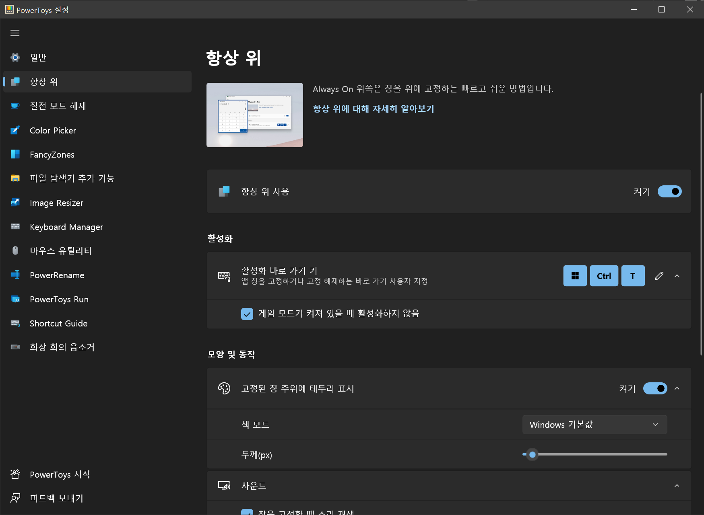

**Always on Top**은 어떤 창을 모든 창 위에 위치하도록 고정하는 기능입니다.

### 설정

|설정|설명|
|:---|:---|
|활성화 바로 가기 키|해당 창에 대해 항상 맨 위에 표시를 하거나 해제하기 위한 사용자 지정 가능한 키보드 명령|
|게임 모드가 켜져 있을 때 활성화하지 않음|게임 중일 때 이 기능을 비활성화|
|색|강조 테두리의 색|
|테두리 두께(px)|강조 테두리의 두께(픽셀)|
|소리 내기|사용자가 이 기능이 활성화된 것을 인식할 수 있도록 작은 경고음을 재생|
|제외된 앱|이 기능을 적용시키지 않을 프로그램(메모장(`Notepad`)를 제외하고자 한다면 `Notepad.exe`를 추가)|
