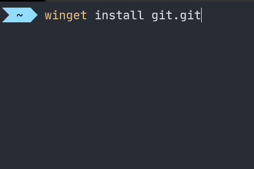
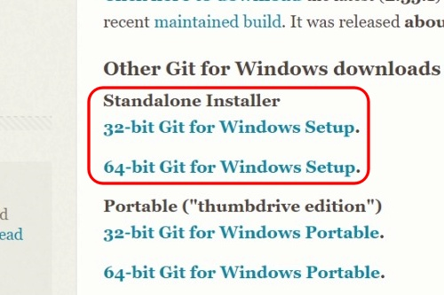

## 설치

Git은 `winget` 명령어나 홈페이지에서 설치 파일을 다운로드하여 설치할 수 있습니다. 익숙한 도구를 이용해서 설치하면 됩니다.

### Winget

```script
winget install git.git
```



### 홈페이지 다운로드

1. <https://git-scm.com/> 이동
2. [Download for Windows] 버튼 클릭

    

3. 현재 환경에 맞는 것을 골라 클릭

    

## Git 최초 설정

1. 사용자 이름 입력하기 (예: `jjh`)

    ```script
    git config --global user.name "jjh"
    ```

2. 사용자 이메일 (예: `joojinhyun00@gmail.com`)

    ```script
    git config --global user.email "joojinhyun00@gmail.com"
    ```
