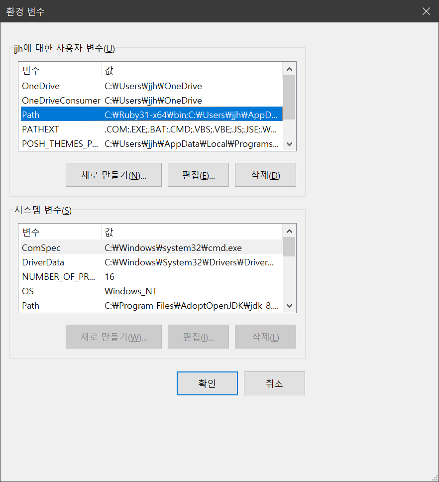
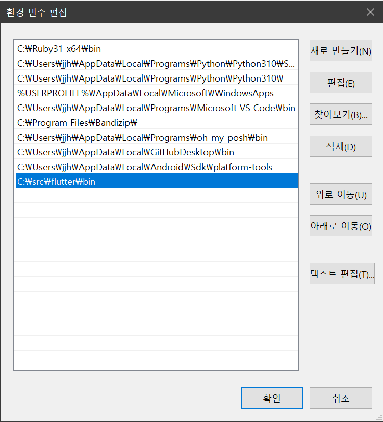
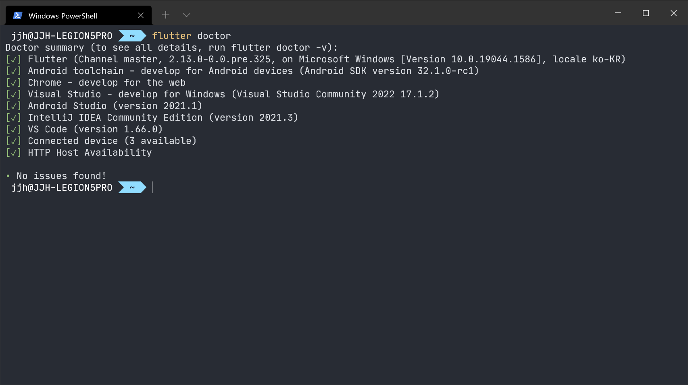

[윈도우에서 플러터 개발 환경을 구축](https://docs.flutter.dev/get-started/install/windows)하는 방법에 대해 소개합니다.

## 시스템 요구사항

- 운영 체제: 윈도우 7 이상
- 저장 공간: 1.64 GB 이상
- 도구:
  - 윈도우 파워쉘 5.0 이상
  - Git 2.x

## 플러터 SDK 다운로드

1. [SDK 다운로드 클릭](https://docs.flutter.dev/development/tools/sdk/releases)
2. 압축을 풀고 포함된 `Flutter`를 원하는 위치(예: `C:\src`)에 옮깁니다.

**경고**: 높은 권한이 필요한 `C:\Frogram Files\`와 같은 디렉토리에 `Flutter`를 이동하지 마세요.
{: .notice--danger}

또는 Github의 리토지토리를 클론할 수도 있습니다.



git clone https://github.com/flutter/flutter.git -b stable



gh 명령어:



gh repo clone flutter/flutter



### Path 추가

flutter에 쉽게 접근할 수 있도록 환경변수를 설정합니다.

1. 계정의 환경변수 편집 이동
   
2. `<경로>\flutter\bin` 추가
   

## flutter doctor 실행

플러터 개발환경이 제대로 구축되었는지 확인해야 합니다.



flutter doctor



다음과 같이 모두 체크 표시가 되면 모든 준비가 완료되었습니다.



**참고**: 플러터를 처음 설정한다면 위 이미지와 다르게 많은 항목에서 X 표시가 되었을 겁니다. 몇몇은 X여도 상관 없습니다. 필수 요소에 해당되는 요소만 다음 섹션에서 설정합니다.
{: .notice--warning}

## 안드로이드 설정

플러터는 안드로이드 플랫폼 종속성을 제공하기 위해 안드로이드 스튜디오의 전체 설치에 의존합니다. 따라서 안드로이드 스튜디오를 설치하고 사전 구성이 필요합니다.

### 안드로이드 스튜디오 설치

안드로이드 스튜디오를 설치하는 방법은 크게 2가지가 있습니다.

- [winget 명령어](#winget-설치)
- [공식 홈페이지](#공식-홈페이지-다운로드)

#### winget 설치



winget install google.androidstudio



#### 공식 홈페이지 다운로드

공식 홈페이지: <https://developer.android.com/studio>

### 안드로이드 장치 설정

안드로이드 기기에서 플러터 앱을 실행하고 테스트하기 위해 준비하려면 안드로이드 4.1 (api level 16) 이상을 실행하는 안드로이드 기기가 필요합니다.

1. 장치에서 개발자 옵션 및 USB 디버깅을 활성화홥니다.
2. 윈도우 전용 [Google USB 드라이버](https://developer.android.com/studio/run/win-usb)를 설치합니다.
3. USB 케이블을 사용하여 휴대전화를 컴퓨터에 연결합니다. 장치에 메시지가 표시되면 컴퓨터가 장치에 접근할 수 있도록 승인합니다.
4. 터미널에서 `flutter devices` 명령을 실행하여 플러터가 연결된 안드로이드 기기를 인식하는지 확인합니다.

### 안드로이드 에뮬레이터 설정

물리적 장치 연결이 아닌 가상의 장치를 만들어 플러터 앱을 테스트할 수 있습니다.

1. 컴퓨터에서 [VM 가속](https://developer.android.com/studio/run/emulator-acceleration)을 활성화합니다.
2. 안드로이드 스튜디오를 실행하고 AVD 매니저를 열어 `Create Virtual Device...`를 선택합니다.
3. 장치 정의를 선택하고 다음을 선택합니다.
4. 에뮬레이션하려는 안드로이드 버전에 대한 하나 이상의 시스템 이미지를 선택하고 다음을 선택합니다. x86 또는 x86_64 이미지가 권장됩니다.
5. 에뮬레이트된 성능에서 **Hardware-GLES 2.0**을 선택하여 하드웨어 가속을 활성화합니다.
6. AVD 구성이 올바른지 확인하고 마침을 선택합니다.
7. 안드로이드 가상 장치 관리자의 도구 모음에서 실행을 클릭합니다. 에뮬레이터가 시작되고 선택한 OS 버전 및 장치에 대한 기본 캔버스가 표시됩니다.

## 안드로이드 라이선스에 동의

플러터를 사용하기 전에 안드로이드 SDK 플랫폼의 라이선스에 동의해야 합니다. 이 단계는 위에 나열된 도구를 설치한 후에 수행해야 합니다.

1. JDK 8 이상이 설치되어 있고 JAVA_HOME 환경 변수가 제대로 설정되어 있는지 확인하세요.
2. 콘솔 창을 열고 다음 명령을 실행하여 라이선스 서명을 시작합니다.

    ```shell
    flutter doctor --android-licenses
    ```

## 윈도우 설정

플러터 2.10 버전부터 윈도우 애플리케이션 개발을 지원합니다.

### 추가 윈도우 요구사항

윈도우 데스크톱 개발의 경우 플러터 SDK 외에 다음이 필요합니다.

- Visual Studio 2022
  - C++를 사용한 데스크톱 개발

**참고**: Visual Studio는 Visual Studio Code와 다릅니다.
{: .notice--info}

자세한 내용은 [플러터에 대한 데스크톱 지원](https://docs.flutter.dev/desktop)을 참조하세요.

## 웹 설정

플러터는 `stable` 채널에서 웹 애플리케이션 구축을 지원합니다. 플러터 2에서 만든 모든 앱은 자동으로 웹용으로 빌드됩니다.

## 에디터 설정

플러터 개발은 다양한 IDE에서 진행할 수 있습니다.

- Android Studio
- IntelliJ
- Visual Studio Code
- Emacs

### Visual Studio Code

설치해야 할 익스텐션은 다음과 같습니다.

- Dart
- Flutter

익스텐션 설치가 완료되었으면 터미널을 열어 Visual Studio Code 항목이 체크표시가 되었는지 확인합니다.

1. 터미널 창 열기 (Ctrl + `)
2. `flutter doctor` 명령 실행

## 프로젝트 생성

Visual Studio Code 기준으로 설명됩니다.

1. 명령 파레트 실행 (Ctrl + Shift + P)
2. `flutter`를 입력하고 `Flutter: New Project`를 선택
3. `Application` 선택
4. 프로젝트의 디렉토리를 지정
5. 프로젝트의 이름은 `myapp`으로 입력

조금 기다리면 프로젝트가 생성되고 `main.dart` 파일이 보입니다.

**참고**: 안드로이드의 패키지 이름은 회사 도메인의 역순(예: com.example)입니다. 앱을 출시할 예정이라면 미리 패키지를 설정하는 것이 좋습니다.
{: .notice--info}

## 앱 실행

1. 하단 상태표시줄을 확인합니다.
2. 장치 선택기 영역에서 장치를 선택합니다. 자세한 내용은 [플러터 장치 간 빠른 전환](https://dartcode.org/docs/quickly-switching-between-flutter-devices/)을 참조하세요.
   - 사용할 수 있는 장치가 없고 장치 시뮬레이터를 사용하려는 경우 장치 없음을 클릭하고 시뮬레이터를 시작합니다.
3. 실행 > 디버깅 시작을 호출하거나 `F5`를 누릅니다.
4. 앱이 실행됩니다. 진행 상황이 디버그 콘솔에 출력됩니다.

앱 빌드가 완료되면 기기에 스타터 앱이 표시됩니다.

### 핫 리로드

플러터는 앱 상태를 중지하고 재빌드하거나 다시 시작하지 않고 빌드된 라이브 상태에서 앱 코드를 다시 로드하는 기능인 Stateful Hot Reload를 통해 연속적인 개발 경험을 제공합니다.

핫 리로드를 경험하기 위해 `main.dart`의 내용을 수정합니다.

```dart
'You have pushed the button this many times'
```

위 문자열을 아래 문자열로 수정합니다.

```dart
'You have clicked the button this many times'
```

저장(Ctrl+S)을 하거나 **핫 리로드** <i class="fas fa-fw fa-bolt"></i> 를 클릭합니다.

실행된 앱에서 즉시 변경된 문자열을 볼 수 있습니다.
