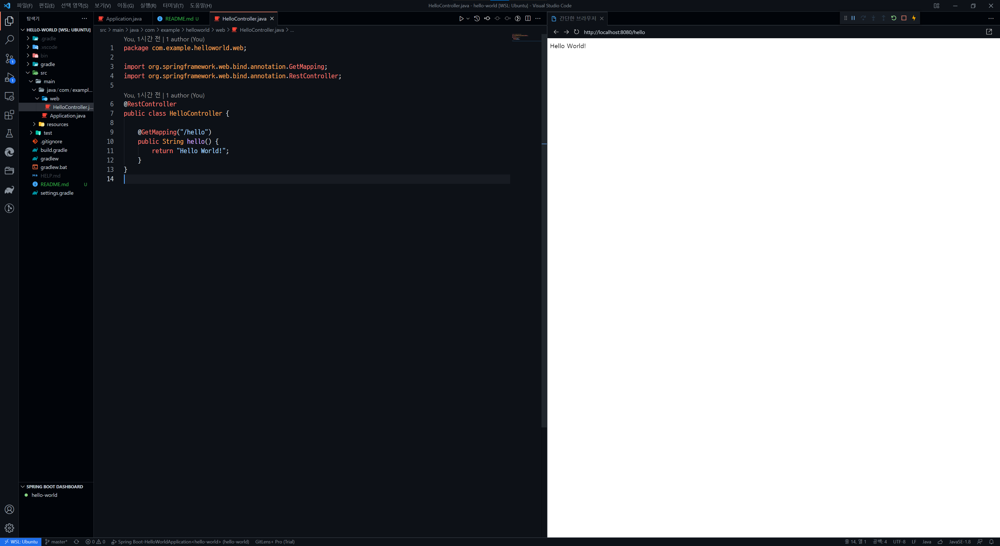

이 포스트에서는 "Hello World"를 출력하는 앱을 개발합니다.

## 1. 프로젝트 생성

이 포스트는 Visual Studio Code를 사용하고 Gradle을 빌드 도구로 사용합니다. 이 [리포지토리](https://github.com/HarryJhin/hello-world){:target="_blank"}를 포크하셔도 됩니다.

1. 명령 파레트 실행(Ctrl+Shift+P)
2. Spring initializr: Create a Gradle Project... 실행
3. 2.6.4 버전 선택
4. Java 선택
5. 그룹 ID com.example 입력
6. 아티팩트 ID hello-world 입력
7. Jar 선택
8. 설치된 JDK 환경에 맞게 선택 (해당 포스트는 JDK 1.8 기준으로 작성되었습니다.)
9. 프로젝트 의존성 Spring Web 선택
10. 프로젝트를 생성할 경로 지정

생성한 프로젝트의 경로로 이동해 작업 영역을 열면 됩니다.

## 2. build.gradle

build.gradle은 스프링 부트의 버전, 앱 버전, 의존성과 의존성을 다운로드할 원격 저장소 등을 명시하는 파일입니다.



plugins {
    id 'org.springframework.boot' version '2.6.4'
    id 'io.spring.dependency-management' version '1.0.11.RELEASE'
    id 'java'
}

group = 'com.example'
version = '0.0.1-SNAPSHOT'
sourceCompatibility = '8'

repositories {
    mavenCentral()
}

dependencies {
    implementation 'org.springframework.boot:spring-boot-starter-web'
    testImplementation 'org.springframework.boot:spring-boot-starter-test'
}

tasks.named('test') {
    useJUnitPlatform()
}



## 3. Application.java

포스트를 그대로 따라서 진행하고 있다면 `src/main/java/com/example/helloworld` 경로에 `HelloWorldApplication.java` 파일이 있습니다. 이 파일의 이름을 직관적이게 `Application`바꾸겠습니다.

이 파일은 프로젝트의 메인 클래스입니다.



package com.example.helloworld;

import org.springframework.boot.SpringApplication;
import org.springframework.boot.autoconfigure.SpringBootApplication;

@SpringBootApplication
public class Application {

    public static void main(String[] args) {
        SpringApplication.run(Application.class, args);
    }

}



**@SpringBootApplication**은 스프링 부트의 자동 설정, Bean 읽기와 생성을 자동으로 설정해줍니다.

**SpringApplication.run()** 메서드를 통해 내장 WAS(Tomcat)를 실행합니다.

**정보**: [커밋](https://github.com/HarryJhin/hello-world/commit/e9bbf90ecbfe79dcbfd69435c79f7785499601e7){:target="_blank"}을 참고하세요.
{: .notice--info}

## 4. hello 컨트롤러 생성

`src/main/java/com/example/helloworld` 경로에 `web` 패키지를 생성합니다.

`web` 패키지 안에 `HelloController.java`를 생성합니다.

`HelloContoller.java` 파일의 내용은 다음과 같습니다.



package com.example.helloworld.web;

import org.springframework.web.bind.annotation.GetMapping;
import org.springframework.web.bind.annotation.RestController;

@RestController
public class HelloController {

    @GetMapping("/hello")
    public String hello() {
        return "Hello World!";
    }
}



**@RestContoller**는 컨트롤러를 JSON으로 반환하는 컨트롤러로 만듭니다.

**@GetMapping**은 HTTP Method의 Get 요청을 받는 API로 만듭니다.

**정보**: [커밋](https://github.com/HarryJhin/hello-world/commit/51873ef11892bc2ea0a0d9ebbd0f892d806f6409){:target="_blank"}을 참고하세요.
{: .notice--info}

## 5. 로컬호스트 확인

이제 결과물을 확인할 시간입니다.

1. 명령 파레트 실행
2. `spring boot dashboard run` 실행
3. 브라우저를 실행하고 주소창에 <http://localhost:8080/hello>{:target="_blank"} 접속

이제 첫 발을 내딛었습니다. 관련하여 다양한 내용은 [여기]({{ site.url }}/frameworks/spring-boot/){:target="_blank"}에 있습니다.
