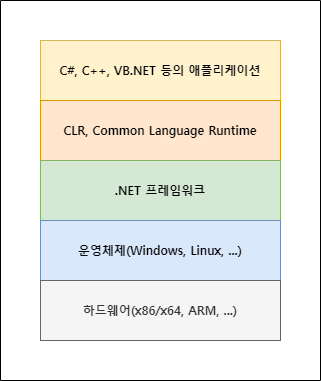
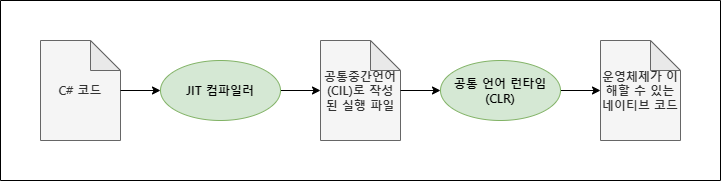

## 개요

C#은 객체 지향 프로그래밍 언어입니다. C#을 사용하면 .NET(닷넷)에서 실행되는 다양한 애플리케이션을 빌드할 수 있습니다. C#은 C 언어에서 유래되었으며 C, C++, Java, JavaScript와 상당한 유사점을 가지고 있습니다.

## .NET 아키텍처

C# 프로그램은 공통 언어 런타임(Common Language Runtime, CLR)에서 실행됩니다.

**참고**: 자바의 JVM과 비슷하다고 생각하시면 됩니다.
{: .notice--info}



C# 컴파일러는 C# 코드를 컴파일해 공통 중간 언어(Common Intermedicate Language, CIL)로 작성된 실행 파일을 만듭니다. 이 파일을 CLR이 컴파일하여 각 운영체제가 이해할 수 있는 네이티브 언어로 만듭니다. 이를 JIT 컴파일이라고 부릅니다.

**참고**: JIT(Just In Time) 컴파일은 실행에 필요한 코드를 실행할 때마다 실시간으로 컴파일해서 실행한다는 의미입니다.
{: .notice--info}

**참고**: 네이티브 언어란 컴퓨터가 이해할 수 있는 기계어를 의미합니다.



## Hello World

```cs
using System;

class Hello
{
    static void Main()
    {
        Console.WriteLine("Hello, World");
    }
}
```
