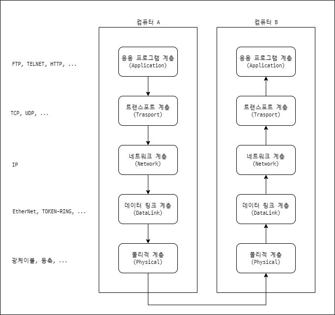

## 개요

자바는 인터넷에서 쓰기 위해 개발되었습니다. 그래서 웹 애플리케이션을 쉽게 개발할 수 있도록 많은 네트워크 관련 기능이 제공됩니다.

네트워크는 서버와 클라이언트가 존재합니다.

- **서버**는 만들어진 서비스를 제공하는 장치입니다.
- **클라이언트**는 서비스를 요청하여 사용하는 장치입니다.

서버와 클라이언트는 정해진 프로토콜(규격)에 따라 통신합니다.

대표적인 서버-클라이언트는 다음과 같습니다.

- **월드 와이드 웹(www)**은 서비스를 제공하는 웹 서버가 있고 클라이언트는 크롬, 엣지와 같은 웹 브라우저입니다. 웹 서버-브라우저의 프로토콜은 **HTTP**입니다.
- **이메일**은 메일 서버가 있고, 클라이언트는 마이크로소프트의 아웃룩과 같은 프로그램이나 구글의 Gmail과 같은 웹 메일이 있습니다. 이메일은 **SMTP** 프로토콜을 사용합니다.
- `google.com`과 같이 사람이 이해할 수 있는 사이트 주소를 [172.217.161.46](https://172.217.161.46)와 같은 숫자로 구성된 IP 주소로 변환해주는 서버가 있습니다. 이 서버는 DNS 서버라고 부르며 DNS(Domain Name System) 프로토콜을 사용합니다.

**참고**: 사이트의 IP 주소를 알고싶으면 터미널에 `nslookup 사이트주소`를 입력하면 됩니다. 구글의 경우 `nslookup google.com`이라고 입력하면 됩니다.
{: .notice--info}

### IP 주소

어떤 컴퓨터에서 다른 컴퓨터와 통신하려면 통신하려는 컴퓨터의 주소를 알아야 합니다. 이 주소를 IP 주소(IP adress)라고 하며 네트워크에 존재하는 컴퓨터를 유일하게 식별할 수 있는 숫자입니다.

IP 주소는 32비트 이진수로 구성되며 숫자 중간에 점으로 자리를 구분합니다.

컴퓨터의 IP 주소를 알아보려면 터미널에 `ipconfig` 명령어를 입력하면 됩니다.

### 호스트 이름

호스트 이름은 네트워크의 컴퓨터 이름을 말합니다. 호스트 이름은 DNS를 사용하여 생성합니다. DNS는 사람이 이해할 수 있는 문자열을 사용하여 이름을 지어줍니다. 구글에 접속하기 위해 google.com을 사용할 수 있는 이유가 이 때문입니다.

모든 컴퓨터는 자신을 카리키는 특수한 호스트 이름 'localhost'와 IP 주소 '127.0.0.1'를 가지고 있습니다. 이를 통해 네트워크 프로그램을 테스트할 수 있습니다.

### URL

URL(Uniform Resource Locator)은 인터넷에 파일이나 데이터베이스같은 리소스에 대한 주소를 지정하는 방법을 말합니다. 우리가 인터넷에서 웹페이지를 볼 때 브라우저의 주소칸에 적어주는 값입니다.

URL은 프로토콜과 자원의 이름으로 구분됩니다.

이 포스트의 URL을 통해 URL에 대해 이해해보겠습니다.

{{ site.url | append: '/languages/java/네트워크/' }}

- `https:`는 서버와 클라이언트가 통신할 때 사용하는 프로토콜입니다.
- `jinhyun.blog`는 호스트 이름으로 자원의 이름 중 하나입니다.
- `/languages/java/네트워크/`는 파일 이름으로 파일의 경로와 파일의 이름이 표현되며 자원의 이름 중 하나입니다.

자원의 이름은 호스트 이름, 파일 이름, 포트 번호, 참조 등의 필드로 구성되어 있으며 호스트 이름과 파일 이름은 필수이고 나머지는 선택입니다.

### 프로토콜(Protocol)

대한민국의 사람끼리 대화할 때 한국어를 사용합니다. 한국어로 대화하는 이유는 이해할 수 있는 문법과 의미가 정해져 있기 때문입니다. 여기서 한국어는 사람과 사람이 대화하는 데 쓰는 프로토콜(규약)이라고 할 수 있습니다.

컴퓨터와 통신할 때도 서로 이해할 수 있는 프로토콜이 필요합니다. 프로토콜은 본래 외교에서 의정서를 나타내는 말이나 네트워크에서는 장치간 통신에 무엇을, 어떻게, 언제 할 것인지를 약속한 규약을 의미합니다.

컴퓨터 간의 통신에는 단순히 프로토콜로 정의되는 것이 아니라 다양한 단계(층)를 거치게 됩니다.



- 물리적 계층은 bit들이 전기, 빛, 무선 신호 등으로 부호화됩니다. RS-232, SONET, WiFi 프로토콜이 여기에 해당됩니다.
- 데이터 링크 계층은 점대점 프로토콜인 PPP(point-to-point protocol)가 오류를 감지합니다.
- 네트워크 계층은 IP(Internet Protocol)를 사용하며 주소 기능을 구현합니다.
- 트랜스포트 계층은 TCP 등이 있고 오류 감지와 정정을 구현합니다. IP와 묶어 TCP/IP로 묶어 부르기도 합니다.
- 응용 프로그램 계층은 SMTP와 같은 응용 서비스에 관련된 프로토콜을 다룹니다.

이 중 트랜스포트에서 좀 더 생각해야 될 것이 있습니다. 트랜스포트 계층의 프로토콜로 TCP와 UDP가 있는데 각각 장단점이 있기 때문에 어떤 것을 사용할지 선택해야 합니다.

- TCP(Transmission Control Protocol)는 먼저 서로를 연결한 후 데이터를 주고 받는 프로토콜입니다. 전화와 비슷합니다.
- UDP(User Datagram Protocol)는 연결하지 않고 데이터를 몇 개의 고정 길이의 패킷(다이어그램)으로 분할한 후 패킷의 앞에 주소를 붙여서 전송하는 프로토콜입니다. 우편과 비슷합니다.

#### TCP(Transmission Control Protocol)

**TCP**는 장치와 장치를 연결하고 데이터를 주고 받는 방식으로 연결을 미리 해두기 때문에 신뢰성이 높습니다. 전화와 비슷하다고 할 수 있는데 발신자가 전화를 걸어 수신자가 받으면 통화를 할 수 있습니다. 통화가 끝나면 연결은 종료됩니다. 통화의 발신자-수신자의 관계가 TCP의 클라이언트-서버와 비슷합니다. 통화는 중간에 상대의 응답을 통해 잘 전달되고 있는지 확인할 수 있고 이는 TCP도 같습니다.

TCP는 데이터를 받는 순서가 데이터를 보내는 순서와 동일합니다. 데이터가 순서가 보장된다고 할 수 있습니다.

단점은 장치간 연결하고 해제하는 과정에 시간이 걸리기 때문에 짧은 데이터를 보내는 경우에는 적합하지 않습니다.

HTTP, FTP, Telnet 등의 프로토콜은 모두 TCP를 사용합니다. 데이터의 순서 보장이 중요하기 때문입니다.

#### UDP(User Datagram Protocol)

**UDP**는 장치를 연결하지 않고 데이터를 몇 개의 고정 길이의 패킷(다이어그램)으로 분할 후 패킷의 앞에 주소를 붙여 전송합니다. 편지와 비슷하다고 할 수 있는데 편지에는 도착지를 위한 배송지 주소가 붙어 있고 우체국에서 배송지를 보고 배달하기 때문입니다. 편지는 배달 과정에서 누락될 경우가 있을 수 있고 우체국에 도착한 순서대로 도착지에 배송하지 않습니다. UDP도 이와 같습니다.

UDP는 신뢰도가 필요하지 않은 통신에 쓰입니다. 또한 TCP와 다른 점은 연결을 하지 않고 송신측에서 일방적으로 전송하는 방식입니다. 이로 인해 TCP보다 빠르고 효율적으로 통신이 가능합니다.

동영상 스트리밍 서비스와 같이 패킷의 손실이나 순서가 중요하지 않은 경우에 UDP를 사용합니다.

### 포트(port)

기본적으로 컴퓨터에는 하나의 물리적인 통신선이나 WiFi 등을 통하여 외부와 연결되어 있으나 연결된 컴퓨터에서 실행되는 네트워크 응용 프로그램은 한 개가 아닌 여러 개이기 때문에 각각의 프로그램에 분배하기 위한 가상의 경로가 필요합니다. 이것이 포트입니다. 하나의 컴퓨터에는 여러 개의 포트가 존재하며, 어떤 포트를 사용할 것인지를 각 프로그램은 정해야 됩니다. 포트의 범위는 0~65535까지의 정수입니다. 그 중 0~1023은 이미 예약되어 있어 사용하면 안 됩니다.

포트 번호는 IP 주소 뒤에 콜론(:)을 붙인 뒤에 붙습니다.

```url
127.0.0.1:4000
```

### 소켓(socket)

TCP는 통신할 대상을 사전에 연결해야 하는데 이를 위해서는 연결 끝점(end point)이 필요합니다. 이것을 소켓이라고 합니다. 소켓은 포트를 기반으로 생성합니다. 하나의 포트에 하나의 소켓이 대응되는 형식입니다.

#### 미국 시각 정보를 얻는 예제

```java
import java.io.IOException;
import java.io.InputStream;
import java.net.Socket;
import java.util.Scanner;

/**
 * 미국 시각(NIST)를 알려주는 서버에 소켓을 사용해 접속하는 클래스
 */
public class SocketTest {
    public static void main(String[] args) {
        try (Socket socket = new Socket("time.nist.gov", 13)) {
            InputStream stream = socket.getInputStream();
            Scanner scanner = new Scanner(stream);

            while (scanner.hasNextLine()) {
                System.out.println(scanner.nextLine());
            }

            scanner.close();
        } catch (IOException e) {
            System.out.println("Unable to connect");
        }
    }
}
```

## IP 주소를 얻는 예제

자바 프로그램으로도 호스트 이름의 IP 주소를 얻을 수 있습니다.

```java
import java.net.InetAddress;
import java.net.UnknownHostException;

/**
 * 호스트 이름을 IP 주소로 출력하는 클래스
 */
public class GetIpAddress {
    public static void main(String[] args) {

        String host = "google.com";

        try {
            InetAddress address = InetAddress.getByName(host);
            System.out.println(address.getHostAddress());
        } catch (UnknownHostException e) {
            System.out.println(host + " not found");
        }

    }
}
```

## 소켓 통신 예제

소켓에 사용할 포트는 예제에서 `999`를 사용하나 만약 이미 사용 중인 포트라고 에러가 뜬다면 임의의 다른 정수로 변경하면 됩니다.

### 서버

```java
import java.io.IOException;
import java.io.PrintWriter;
import java.net.ServerSocket;
import java.net.Socket;
import java.util.Date;

/**
 * 날짜 서버 클래스
 */
public class DateServer {
    public static void main(String[] args) throws IOException {
        ServerSocket serverSocket = new ServerSocket(999);
        try {
            while (true) {
                Socket socket = serverSocket.accept();
                try {
                    PrintWriter printWriter = new PrintWriter(socket.getOutputStream(), true);
                    printWriter.println(new Date().toString());
                } finally {
                    socket.close();
                }
            }
        } finally {
            serverSocket.close();
        }
    }
}
```

### 클라이언트

```java
import java.io.BufferedReader;
import java.io.InputStreamReader;
import java.net.Socket;

/**
 * 날짜 서버에서 날짜 정보를 얻는 클라이언트 클래스
 */
public class DateClient {
    public static void main(String[] args) {
        try {
            Socket socket = new Socket("localhost", 999);
            BufferedReader bufferedReader = new BufferedReader(
                new InputStreamReader(socket.getInputStream())
            );
            String resolution = bufferedReader.readLine();
            System.out.println(resolution);
            socket.close();
            System.exit(0);
        } catch (Exception e) {}
    }
}
```

## UDP 통신 예제

자바는 UDP를 DatagramPacket과 DatagramSocket 클래스로 지원합니다.

- DatagramSocket
- DatagramPacket

### DatagramSocket 클래스

DatagramSocket()은 UDP를 사용하는 소켓을 생성합니다. TCP와 다르게 서버 소켓과 클라이언트 소켓의 구분이 없습니다. 오로지 DatagramPacket 객체만 주고 받을 수 있습니다.

### DatagramPacket 클래스

DatagramPacket은 UDP를 사용해 데이터를 주고 받기 위해 사용하는 클래스입니다. 주고 받을 데이터와 도착지 주소, 포트 번호 모두 DatagramPacket에 포함되어 있습니다. DatagramPacket의 생성자는 두 가지가 있습니다.

- 수신측에서 사용하는 버퍼
- 송신측에서 사용하는 상대방의 주소와 포트 번호가 포함된 형태

### 송수신 예제

#### 송신

```java
import java.io.IOException;
import java.net.DatagramPacket;
import java.net.DatagramSocket;
import java.net.InetAddress;

/**
 * 송신하는 클래스
 */
public class Sender {
    public static void main(String[] args) throws IOException {
        
        DatagramSocket socket = new DatagramSocket();
        String string = "Data";
        byte[] buf = string.getBytes();
        InetAddress address = InetAddress.getByName("127.0.0.1");
        DatagramPacket packet = new DatagramPacket(buf, buf.length, address, 5000);
        socket.send(packet);
        socket.close();
        
    }
}
```

#### 수신

```java
import java.io.IOException;
import java.net.DatagramPacket;
import java.net.DatagramSocket;

/**
 * 수신하는 클래스
 */
public class Receiver {
    public static void main(String[] args) throws IOException {
        
        byte[] buf = new byte[256];

        DatagramSocket socket = new DatagramSocket(5000);
        DatagramPacket packet = new DatagramPacket(buf, buf.length);
        socket.receive(packet);
        System.out.println(new String(buf));
        socket.close();

    }
}
```
