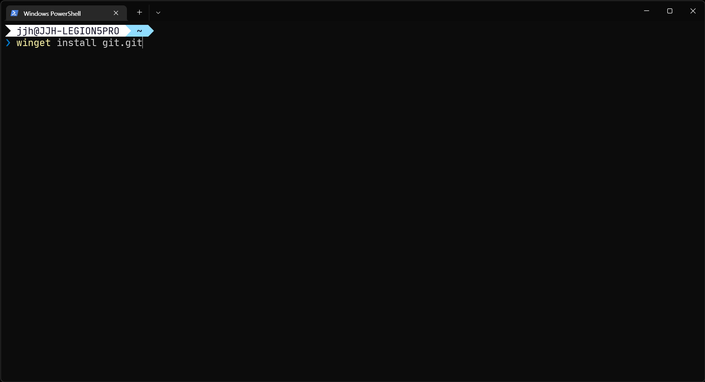

## 개요

Git을 설치하는 방법은 각 운영체제마다 다양하나 기본적으로 간단하게 설치할 수 있는 명령어 기반으로 소개합니다.

## 윈도우

윈도우는 앱 설치 관리자(winget)을 이용하여 간단하게 설치할 수 있습니다.

1. PowerShell 열기
2. `winget install git.git` 명령어 입력

    

3. 설치 완료

**경고**: winget 명령어가 실행되지 않을 경우 [Winget 이슈]({{ site.url }}/winget/winget-issue/)를 참고하세요.
{: .notice--danger}

설치가 완료되면 Git을 사용하기 전에 [최초 설정]({{ site.url }}/tools/git/git-최초-설정/) 단계를 진행하면 됩니다.

## WSL

WSL의 우분투는 이미 Git이 설치되어 있습니다. 따라서 [최초 설정]({{ site.url }}/tools/git/git-최초-설정/)을 진행하시면 됩니다.
