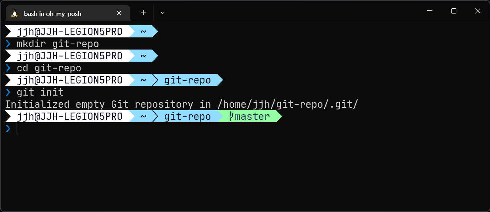
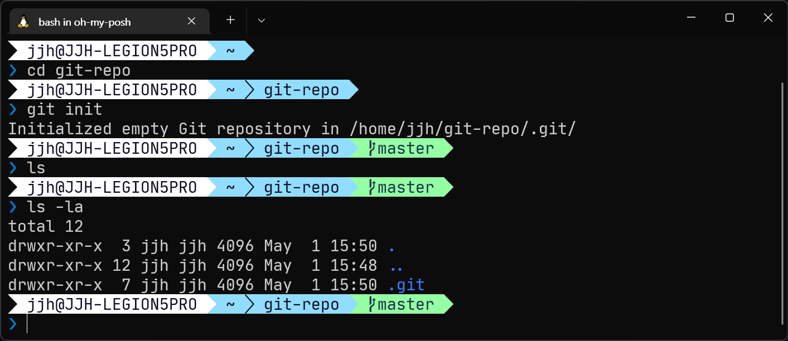

## 개요

깃을 사용하기 위해서 어떤 폴더를 깃 리포지토리로 만들 필요가 있습니다.

간단하게 `git init` 명령어를 사용하면 깃 리포지토리가 되고 변경 사항을 기록하게 됩니다.

실제로 어떻게 사용하는지 더 알고 싶다면 [예제](#예제)를 참고하세요.

## 예제

1. 터미널을 엽니다.

2. `git-repo` 디렉토리를 생성하고 이동합니다.

    **참고**: 디렉토리 이름은 아무거나 하셔도 됩니다. `git-repo`는 예시를 위한 이름입니다.
    {: .notice--info}

    ```bash
    mkdir git-repo
    cd git-repo
    ```

    

3. `git-repo` 디렉토리를 깃 리포지토리로 만듭니다.

    ```bash
    git init
    ```

    

이제 `git-repo` 디렉토리는 깃 리포지토리로 초기화되었습니다. `git init` 명령어는 `.git` 디렉토리를 생성하고, 앞으로 `git-repo` 디렉토리의 변경 사항을 기록한 버전이 저장됩니다.

생선된 `.git` 디렉토리는 `ls -la` 명령어를 통해서 확인할 수 있습니다.

```bash
ls -la
```



**주의**: `.git` 디렉토리는 숨김이기 때문에 `ls` 명령어로는 볼 수 없습니다.
{: .notice--warning}
