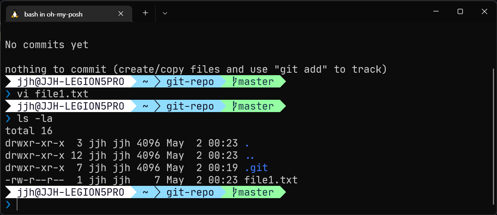

## 개요

우리가 깃을 사용하는 이유는 버전 관리를 위해서입니다.

여기서 말하는 버전이란 흔히 프로그램의 버전을 뜻하는 개념과 흡사합니다.

A에서 어떤 것이 추가된 B는 서로 차이가 있고 이를 구분하기 위해 버전 개념이 존재합니다.

버전은 우리가 임의적으로 숫자(예: v0.1, v0.2 등)를 부여하여 구분하거나, 별개의 공간에 저장하는 방식으로도 할 수 있습니다.

다만 많이 번거럽고 사용자가 일일이 조정해야한다는 점에서 일괄적으로 변경 사항을 버전으로 기록할 도구가 필요합니다.

우리는 버전 관리를 도와주는 도구 중 깃에 대해 알아봅니다.

깃은 개념적으로 Working Tree, Staging Area, Repository가 있고 이를 이해해야 깃을 사용할 수 있습니다.


- `git-repo`디렉토리는 깃이 기록 중인 디렉토리입니다.
- `.git` 디렉토리는 변경 사항 정보를 기록한 버전을 저장하는 숨김[^1] 디렉토리로, `Staging Area`, `Repository`가 해당됩니다.
- `Working Tree`는 수정, 저장 등이 일어나는 디렉토리를 말하며, `git-repo` 디렉토리가 곧 작업 트리입니다.
- `Staging Area`는 버전으로 만들 파일이 대기하는 영역입니다.
- `Repository`는 대기한 파일을 버전으로 만들어 저장합니다.

## Working Tree

워킹 트리는 디렉토리 자체를 말하며, 눈에 보이는 작업 공간이라고 생각하면 됩니다.

위 그림을 기준으로 `git-repo` 디렉토리가 워킹 트리가 됩니다.

워킹 트리에서 파일을 추가/수정/삭제 작업을 진행합니다.

## Staging Area(=Stage)

스테이지(대기 영역)는 버전에 포함시킬 파일을 준비시키는 대기실이라고 생각하면 됩니다.

작업 트리에서 추가/수정/삭제된 파일이 다섯 개라면, 사용자는 이 중 원하는 파일만 선택해 대기(스테이징) 시킬 수 있습니다.

대기 영역의 진정한 의의는 작업한 파일 중 안전한(기능에 지장을 주지 않는) 파일만 선별해서 버전에 기록시킬 수 있다는 것입니다.

물리적 위치는 `.git/index` 입니다.

## Repository

리포지토리는 스테이지에서 대기하던 파일들을 버전으로 기록하고 저장합니다.

물리적 위치는 `.git/HEAD` 입니다.

## 예제

앞서 설명한 워킹 트리 → 스테이지 → 리포지토리 순서가 어떻게 진행되는지 예제를 통해 알아보겠습니다.

1. `git-repo` 디렉토리의 깃 상태를 확인합니다.

    ```bash
    git status
    ```

    .png)

    - `On branch master`는 현재 브랜치가 `master`라는 의미입니다.
    - `No commits yet`는 아직 커밋한 파일이 없다는 의미입니다.
    - `nothing to commit`는 커밋할 파일(스테이징)이 없다는 의미입니다.

2. vim 에디터로 `file1.txt` 파일을 생성하고, 'A' 키를 입력해 수정 모드로 바꾼 뒤 `file 1`을 타이핑합니다.

    ```bash
    vim file1.txt
    ```

    

3. `ESC` 키를 입력해 수정 모드를 종료하고, `:wq`를 입력해 저장하고 vim을 종료합니다.

    

4. `git-repo` 디렉토리의 파일 현황을 파악합니다.

    ```bash
    ls -la
    ```

    

    `file1.txt`가 생긴 것을 확인할 수 있습니다.

5. `git-repo` 디렉토리의 깃 상태를 확인합니다.

    ```bash
    git status
    ```

    .png)

    Untracked files 항목이 새로 생기고 방금 만든 `file1.txt` 파일이 보입니다. 워킹 트리에 해당하기 때문인데 스테이징을 하지 않고 워킹 트리에만 있는 파일이 있다면 이렇게 보입니다.

6. `file1.txt` 파일을 스테이징하고, 깃 상태를 확인합니다.

    ```bash
    git add file1.txt
    ```

    `git add <file>` 명령어를 통해 특정 파일을 스테이징할 수 있습니다.

    **주의**: 깃이 스테이징 및 커밋하는 대상은 디렉토리가 아니라 파일입니다. 파일의 경로를 버전 정보에 기록하면서 파일이 위치한 경로가 저장되는 형식입니다.
    {: .notice--warning}

    .png)

    스테이징한 뒤 깃 상태를 확인하면 스테이징 되어 있는 파일 목록을 볼 수 있습니다.

7. 스테이징 중인 파일을 커밋하여 버전에 기록합니다. 커밋은 스테이지에 있는 파일을 리포지토리로 이동시킵니다.

    ```bash
    git commit -m "file1.txt 파일 커밋"
    ```

    `-m "커밋 메시지"`은 이 커밋이 어떤 내용의 커밋인지 파악할 수 있게 하기 위해 적는 옵션으로 커밋마다 버전이 새롭게 갱신된다고 생각하면 됩니다.

    .png)

8. 어떤 일이 있었는지 확인하기 위해 깃 로그를 살펴봅니다.

    ```bash
    git log
    ```

    

    - `commit` 뒤에 있는 문자열은 커밋 해시(hash)라고 하며, 커밋한 파일 정보를 토대로 생성되기 때문에 버전을 의미하기도 합니다.
    - `HEAD -> master`는 master 브랜치에서 가장 최신이라는 의미입니다. HEAD는 `.git` 디렉토리 안에 있고 현재 리포지토리라 가리키는 버전이라고 생각하면 됩니다.

---

[^1]: 숨김은 일반적인 환경에서는 확인할 수 없도록 숨기는 옵션을 말합니다. 숨김 옵션이 있는 디렉토리나 파일을 확인하려면 특수한 방법을 사용해야 합니다.
