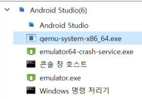

## 개요

최근에 안드로이드 스튜디오를 사용하면서 매우 큰 결함을 겪었습니다.

에뮬레이터를 몇 번 조작만 하면 **화면 연결이 끊어**져서 조작을 할 수 없는 상태가 됩니다.

에뮬레이터가 죽은 것이 아닌 화면 연결이 끊어지는 문제는 정말 답답합니다.

## 원인

이 현상의 원인은 드래그나 길게 누르는 등의 롱 제스처 이벤트입니다.

~~아니 이게 안 되면 어떻게 테스트 하라고?~~

더 근본적인 원인은 찾을 수 없어서 그냥 발동 조건만 알았습니다.

## 해결 방법

원인이 되는 제스처를 안쓸 수 없으니 문제가 발생했을 때 대처 방법은 **다시 에뮬레이터를 키면 되는 것**이죠.

다시 켜기 위해서 **기존 프로세스를 종료**해줄 필요가 있습니다.

에뮬레이터 프로세스는 `qemu-system-x86_64.exe`입니다.

이 프로세스를 종료하고 디바이스 매니저에서 해당 에뮬레이터를 실행하면 됩니다.

물론 프로세스 종료 후 다시 키는 것이기에 연속성은 개나 줘버리고 없습니다.
