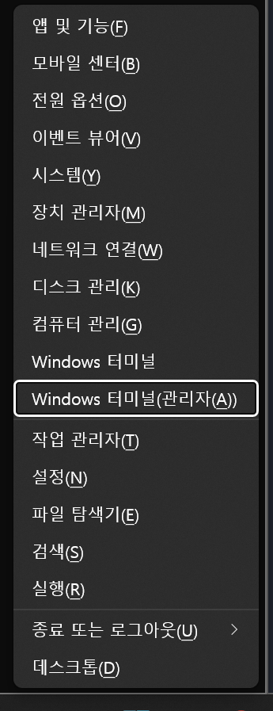
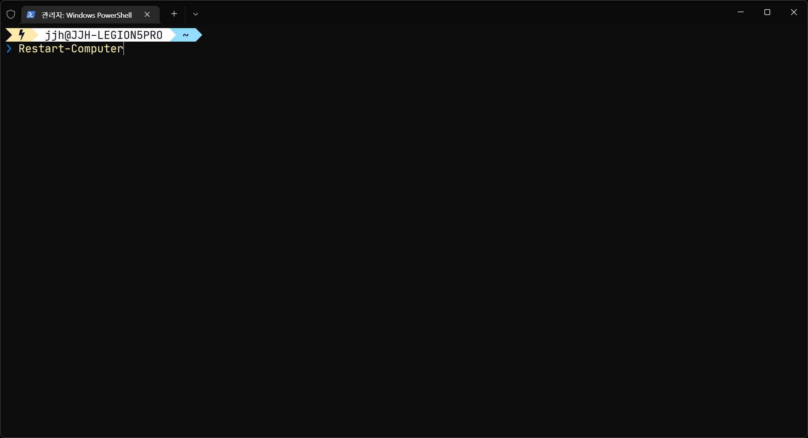

## 개요

WSL은 윈도우와 리눅스를 동시에 쓸 수 있는 방법 중 하나입니다. 과거 Hyper-V 기술을 기반으로 구현되어 Pro, Education 사용자만 사용할 수 있었지만 현재는 아니기 때문에 Home 사용자도 사용 가능한 상태입니다.

WSL을 사용하는 가장 큰 이유는 Linux 환경이 좀 더 개발 환경 세팅이 편하기 때문으로 생각하면 됩니다. 하다 못해 GCC, G++ 컴파일러 설치를 윈도우에서 한다고 하면 MinGW가 가장 대표적인데 설치 과정이 절대 간단하지 않습니다. Linux는 이런 불편함을 명령어(apt, brew 등) 하나로 해결할 수 있기 때문입니다.

윈도우에도 chocolatey가 있지만 모든 것을 지원하지 않을 뿐더러 유수한 역사가 있고 검증된 apt에 비하면 손색이 있을 수 밖에 없습니다.

## 필요한 것

- 윈도우 10/11
- 윈도우 터미널(wt.exe)
- 파워쉘(PowerShell)

## 설치

1. `Win` + `X` 단축키 실행으로 빠른 링크를 엽니다.
2. Windows 터미널(관리자(A)) 선택

    

3. `wsl --install` 명령어를 입력합니다.

    .png)

    .png)

4. `Restart-Computer` 명령어를 입력하고, 시스템이 다시 시작됩니다.

    

5. 다시 시작된 후 우분투가 실행됩니다. 우분투 사용을 위한 `username`, `password` 최초 설정을 진행합니다.

    .png)

    .png)

    .png)

6. WSL 사용 준비가 완료되었습니다.

    .png)

## 최초 실행

먼저 리눅스에서의 국룰 apt 업데이트, 업그레이드를 수행합니다.

```bash
sudo apt update && sudo apt upgrade
```

**참고**: `update`는 업데이트할 리스트를 갱신하고, `upgrade`는 `update`로 갱신된 업데이트 리스트를 토대로 업그레이드하는 명령어입니다.
{: .notice--info}

.png)

WSL의 우분투는 Git이 사전에 설치되어 있습니다. 따라서 [Git 최초 설정]({{ site.url }}/tools/git/git-최초-설정/) 과정이 필요합니다.

이로써 최소한의 준비는 완료되었습니다.
