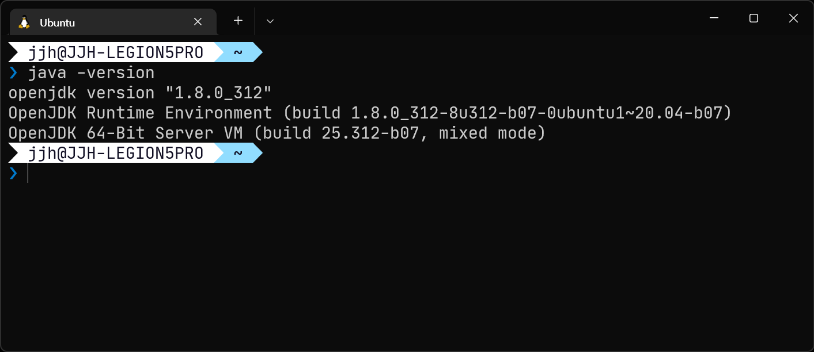
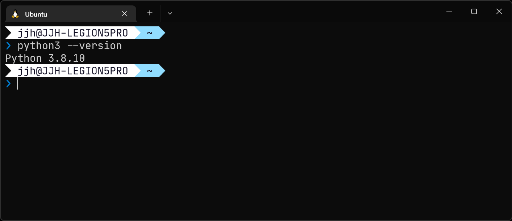

## 개요

WSL은 기본적으로 Ubuntu 20.04 LTS를 사용합니다. 따라서 개발환경도 기존 우분투와 그대로입니다.

각 언어별 설치 과정은 다음을 참고하세요.

- [C/C++](#cc)
- [Java](#java)
- [Python](#python)

## C/C++

gcc/g++ 컴파일러가 설치되어 있는지 확인합니다.

```bash
gcc --version
g++ --version
```



위와 같지 않다면 설치가 필요합니다.

```bash
sudo apt install build-essential
```

**build-essential** 패키지는 libc, gcc, g++, make, dpkg-dev 등이 포함되어 있습니다. 즉, C/C++ 개발을 한다면 이 패키지만 설치하면 됩니다. 이름은 모든 언어를 설치할 수 있을 것 같지만 아닙니다.

## Java

자바가 설치되어 있는지 확인합니다.

```bash
java --version
```



위와 같지 않다면 설치가 필요합니다.

```bash
sudo apt install openjdk-8-jdk
```

만약 Homebrew를 통한 설치를 원한다면 다음 명령어를 사용하면 됩니다. ~~이걸 쓴다면 이 포스트를 볼 일도 없지만~~

```bash
brew isntall openjdk@8
```

## Python

파이썬은 사전 설치되어 있기 때문에 설치가 필요하지 않습니다.

어떤 파이썬이 설치되어 있는지 확인해봅니다.

```bash
python3 --version
```



위와 같지 않다면 설치가 필요합니다만 그럴 일은 없습니다.
