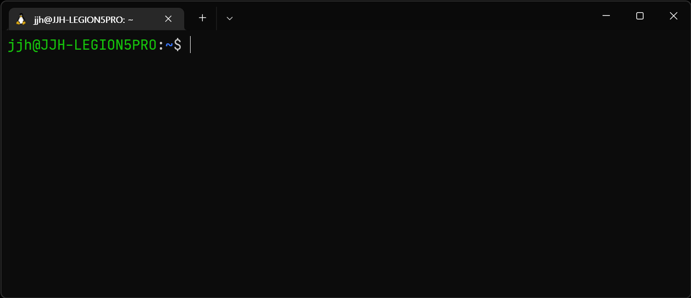

## 개요



우리가 아무것도 꾸미지 않은 bash는 너무나도 식상하여 개발 의욕을 저하(?)시키는 원인입니다. 따라서 우리는 좋은 테마로 눈을 즐겁게 하여 개발 의욕을 향상시킬 의무가 있습니다.

## Oh My Posh

bash를 꾸미는 대표적인 것은 Oh My Posh 입니다. json으로 정의되어 있는 테마 파일을 적용하는 방식입니다.

설치하는 방법은 두 가지입니다.

- brew 명령어(권장)
- wget 다운로드

이 포스트에서는 wget 다운로드 방법을 소개하지 않습니다. 알고 싶다면 [공식 문서](https://ohmyposh.dev/docs/installation/linux)를 참고하세요.

## oh-my-posh 설치

brew 명령어는 Homebrew를 설치하면 사용할 수 있습니다.

설치는 다음 명령어를 입력하면 됩니다.

```bash
brew install jandedobbeleer/oh-my-posh/oh-my-posh
```

두 가지가 설치됩니다.

- `oh-my-posh`: 실행 파일이고, `$(brew --prefix)/bin`에 있습니다.
- `themes`: Oh-My-Posh의 테마들이 있는 폴더이고, `$(brew --prefix oh-my-posh)/themes`에 테마들이 있습니다.

최신 버전과 다를 수 있기 때문에 업데이트를 진행합니다.

```bash
brew update && brew upgrade oh-my-posh
```

이제 테마 적용을 위한 추가 작업이 필요합니다.

```bash
echo 'eval "$(oh-my-posh init bash)"' >> ~/.profile
```

수정된 `~/.profile`을 즉시 적용합니다.

```bash
. ~/.profile
```


위 이미지는 버그로 제대로 출력되지 않은 상황입니다. [해결 방법]({{ site.url }}/tools/wsl/oh-my-posh-issue/)을 참고하세요.
