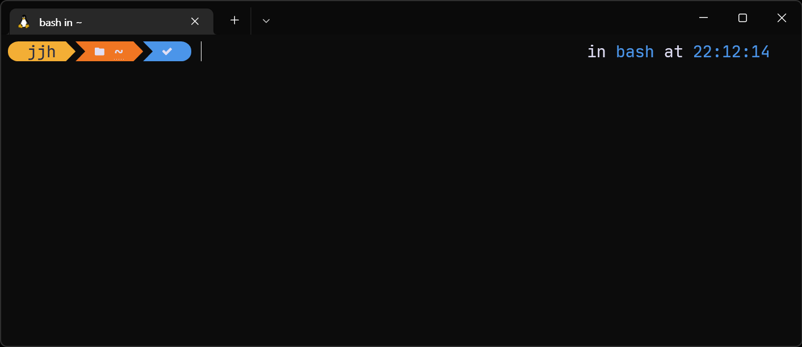

.png)

위 이미지 처럼 처음 쉘을 열었을 때 적용한 테마 그래픽이 텍스트가 있는 부분만 출력되어 나오는 이슈가 있습니다.

동일한 현상을 겪고 있는 분들은 저와 같은 편법을 사용하시면 됩니다.

명령어를 수행하면 그래픽이 정상적으로 출력되는 점을 이용하여 아무 부담이 없는 `clear` 명령어를 첫 실행 때 수행되도록 다음 명령어를 입력합니다.

```bash
echo 'clear' >> ~/.profile
```

처음 실행했을 때 자동으로 `clear` 명령어가 실행되게 해서 프롬프트를 다시 랜더링하게 만듭니다.


