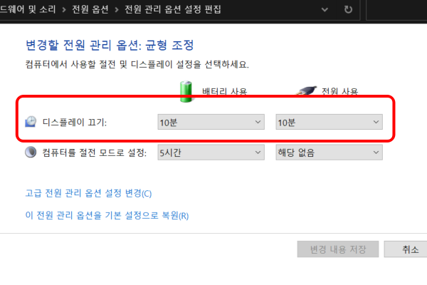

**Awake**는 전원 관리 옵션을 관리할 필요 없이 '절전 모드'와 '디스플레이 끄기'를 조정할 수 있습니다.

절전 모드 해제 사용을 활성화하면 사용 가능합니다.

## 모드

### 선택한 전원 계획을 계속 사용

윈도우 전원 관리 옵션을 변경하지 않습니다.

### 무기한 활성 상태 유지

윈도우 전원 관리 옵션 중 '컴퓨터를 절전 모드로 설정'에 설정된 시간을 무시하고 시스템이 절전 모드가 켜지지 않도록 합니다.

이는 '컴퓨터를 절전 모드로 설정' 옵션 중 해당 없음과 동일한 효과를 가집니다.

### 일시적으로 절전 모드 해제 유지

윈도우 전원 관리 옵션 중 컴퓨터를 절전 모드로 설정 옵션을 재설정합니다. 전원 관리 옵션을 통해서 설정할 경우 사전에 제공된 옵션만 설정할 수 있으나 PowerToys를 사용하면 원하는 시간과 분을 세세하게 설정할 수 있습니다.

## 화면 켜기

화면 켜기 옵션은 전원 관리 옵션 중 디스플레이 끄기 옵션과 관련되어 있습니다.

화면 켜기 옵션이 활성화되면 시간의 흐름에 따른 디스플레이 끄기 옵션이 작동되지 않습니다. 이는 디스플레이 끄기 옵션 중 '해당 없음'과 동일한 효과를 가집니다.

즉, 시스템을 종료하거나 화면 켜기 옵션을 끄지 않는 이상 계속 디스플레이는 켜져 있습니다.
